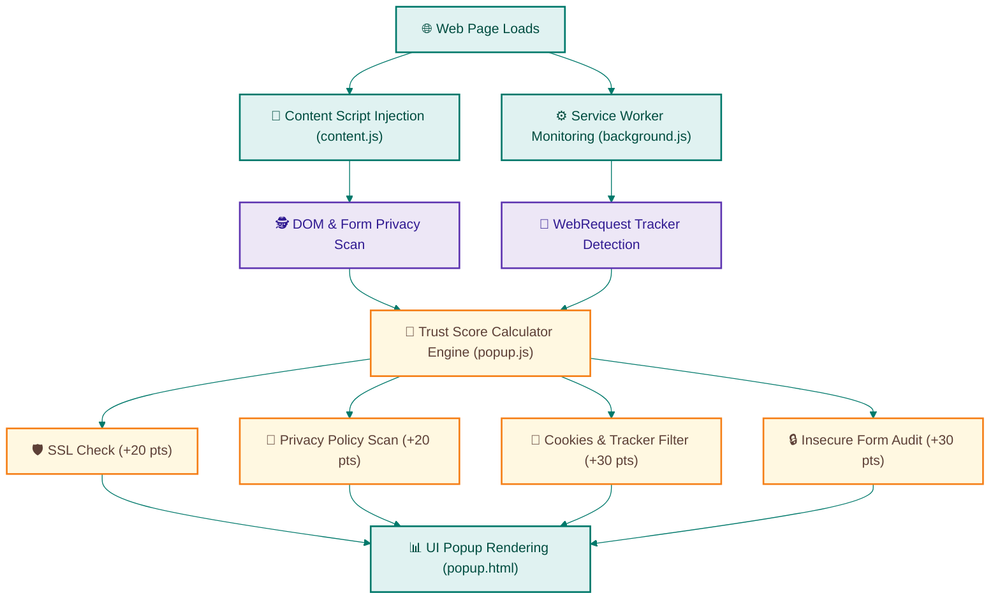

# 🛡️ Digital Trust Extension — Web Privacy Checker

### *HacKronyX Hackathon — Real-Time Privacy Analytics Engine*

---

<div align="center">
  
  
  
</div>

---

## 🎯 Project Overview

This extension was developed for the **HacKronyX Hackathon** (June 27, 2025) organized by **St. Vincent Pallotti College of Engineering and Technology (SVPCET), Nagpur**.

**Digital Trust Extension** is a lightweight, real-time security auditor that evaluates web pages dynamically, calculating a comprehensive **Trust Score out of 100** based on standard security vectors (SSL, trackable cookies, secure forms, and policy pages). It empowers users to make rapid, informed decisions about a site’s trustworthiness at a single glance.

---

## ⚡ Extension Architecture & Scoring Loop



---

## 🚀 Key Feature Audits

### 🔒 1. SSL/TLS Verification (20 Points)
* Automatically scans active protocols to guarantee requests operate via secure **HTTPS** transport layers.

### 📜 2. Privacy Policy Presence (20 Points)
* Employs DOM keyword regex arrays to detect and flag formal Privacy Policy pages, Terms of Service, or GDPR declarations.

### 🍪 3. Tracker & Cookie Analysis (30 Points)
* The **background service worker** leverages Chrome's `webRequest` API to sniff and count third-party tracking scripts, advertising injection payloads, and tracking cookies operating on the tab.

### 🛡️ 4. Form Action Auditing (30 Points)
* Content scripts audit input structures on forms. High-risk actions (such as sending sensitive text or passwords over raw HTTP) are instantly caught, degrading the site's overall score to protect credential leakage.

---

## 🛠️ Step-by-Step Installation Guide

To upload and run the extension locally on your Google Chrome browser:

### **Step 1: Download & Extract**
1. Download this repository as a `.zip` file from the green **Code** button at the top right of this GitHub page.
2. Extract the ZIP file into a dedicated folder on your local computer.

### **Step 2: Open Extensions Hub**
1. Open Google Chrome.
2. Navigate to the extension portal by typing the following into your URL bar and hitting **Enter**:
   ```
   chrome://extensions
   ```

### **Step 3: Enable Developer Mode**
1. Look to the top right of the Chrome Extensions page.
2. Switch on the **Developer mode** toggle.

### **Step 4: Load the Unpacked Extension**
1. In the top-left menu, click the **Load unpacked** button.
2. A local file system navigator will display. Locate the folder where you extracted the ZIP (make sure you select the root folder containing the `manifest.json` file).
3. Click **Select Folder**.

### **Step 5: Access the Trust Panel**
1. The **Digital Trust Extension** card will now display in your loaded list.
2. Pin the extension to your Chrome menu bar and click it on any website to execute a live security scan!

---

## 📁 Extension File Map

```
├── .gitignore       # Prevents caching, local development configurations, and key credentials leak
├── README.md        # Academically designed documentation with dynamic Mermaid flowchart
├── manifest.json    # Chrome Extension MV3 core registration manifest
├── background.js    # Service worker sniffing third-party cookies and tracker scripts
├── content.js       # Injected page scraper evaluating forms, SSL levels, and privacy policy links
├── popup.html       # Dynamic extension popup interface
├── popup.css        # Premium styling system for the popout control panel
├── popup.js         # Trust score computation engine and dashboard driver
└── icons/           # High-resolution extension action icons (16x16, 48x48, 128x128)
```

---

<br>
<p align="center">
  <i>Developed for secure data audit and verified compliance at HacKronyX Hackathon 🛡️.</i>
</p>
